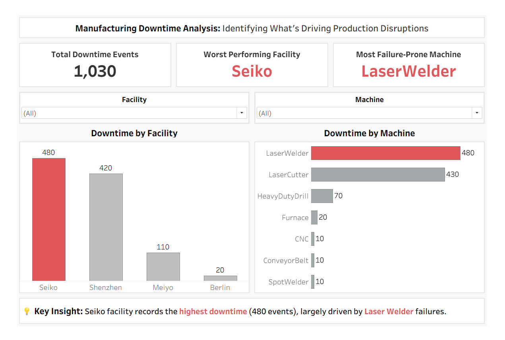
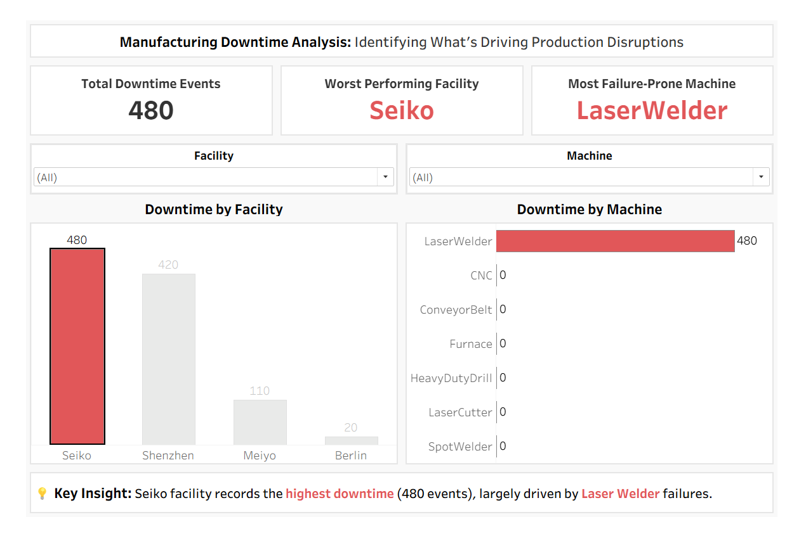

# Manufacturing Downtime Root Cause Analysis

## Business Overview

Delcrone is a manufacturing company that uses Industrial Internet of Things (IoT) sensors to monitor machine health across its production facilities. Each factory contains multiple machine types that send telemetry data every 10 minutes.

Recently, stakeholders observed production delays and operational inefficiencies due to frequent disruptions on the assembly lines.

The technology team collected and converted a month of IoT telemetry data from four production facilities to help identify the root cause of the downtime. 

The goal of this analysis is to identify the primary source of disruption and to provide insights to improve operational efficiency.

### Key Metrics
- Which production facility experiences the highest machine downtime?
- Which machine types contribute the most to downtime in that facility?
- What percentage of total downtime is caused by the most problematic machines?

## Exploratory Data Analysis (EDA)

The telemetry dataset was explored using SQL to understand machine behavior across facilities.

#### Key exploration steps included:
- Inspecting data structure and health status categories
- Identifying all production facilities and machine types
- Measuring machine distribution across factories
- Calculating downtime events by facility
- Identifying machine types responsible for the most failures

[*Check Out EDA and calculated fields*](sql/delcrone_root_cause_analysis.md)

## Insights

Analysis revealed that **Seiko Facility** experiences the highest machine downtime across all facilities.

Further investigation shows that **LaserWelder** is responsible for the majority of downtime events in this facility, making it the most significant contributor to assembly line disruptions.

## Recommendations
- Preventive maintenance efforts should prioritise LaserWelder in Seiko facility.
- Monitor machine health trends weekly to detect early signs of failure.
- Implement automated alerts for machines entering unhealthy states.
